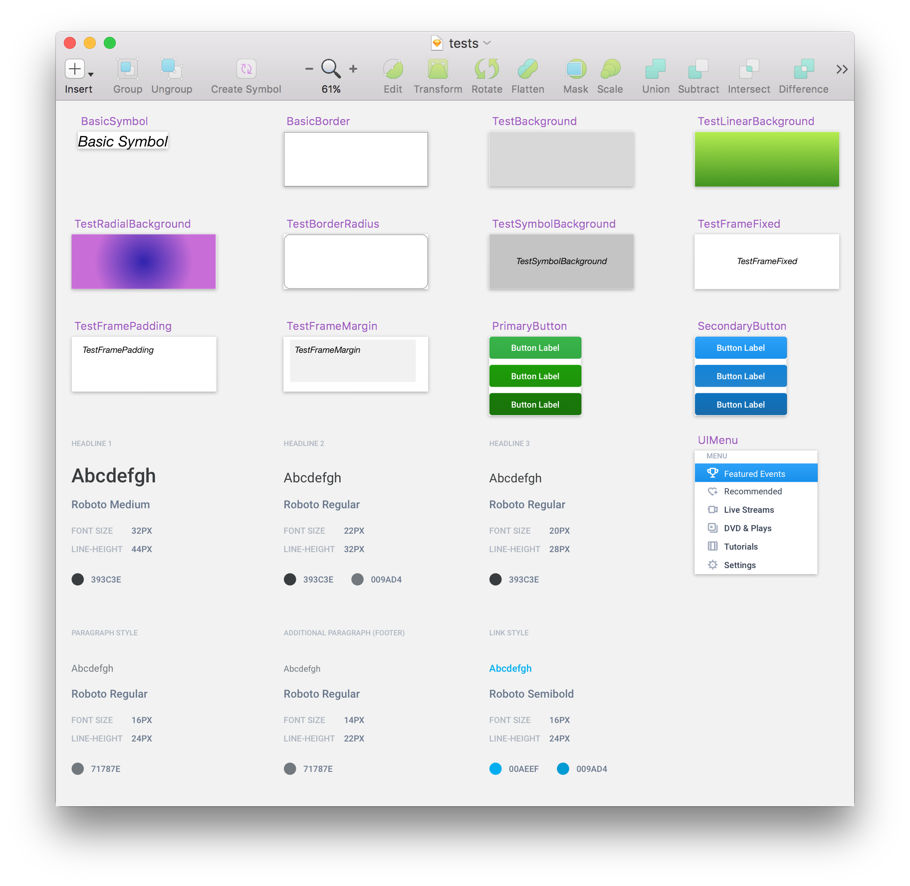

# PostCSS-Sketch Plugin - [](https://travis-ci.org/jturle/postcss-sketch)

Just playing with bringing [Sketch](https://sketchapp.com/) colours, styles, structure,
etc directly into CSS from [SketchApp](https://sketchapp.com/) using
[PostCSS](https://github.com/postcss/postcss).

## TL;DR


[1-min video in action](https://www.youtube.com/watch?v=tCx5az-QR5M)

## Currently Supported Sketch Attributes

- textStyles
    - font, size, color, line-height, weight, style
- sharedStyles (background, border)
    - fills
        - solid background
        - linear background
        - radial background
    - border
        - color & width
    - box-shadow
        - done
    - padding, margins etc (needs work)
- symbols
    - all of the above, nested

## TODO

- Improve documentation (Ughhh - Options, Design Tips)
- Remove repetition for nested items
- Sort out ordering of rules
- Update reference structure? @extends?
- Supprt image assets & SVG

## Quick example...

### This "CSS"...
```css
h1 {
    font: sketch('./tests.sketch').textStyle.Headline_1;
}

h2 {
    font: sketch('./tests.sketch').textStyle.Headline_2;
}

p {
    font: sketch('./tests.sketch').textStyle.Body;
}

a {
    font: sketch('./tests.sketch').textStyle.Link;
}

.sharedStyle {
    extends: sketch('./tests.sketch').sharedStyle.Complex;
    padding: 1rem;
}

.buttonPrimary {
    extends: sketch('./tests.sketch').sharedStyle.ButtonPrimary;
}

.basicSymbolTest {
    extends: sketch('./tests.sketch').symbol.BasicSymbol;
}

.testBackground {
    extends: sketch('./tests.sketch').symbol.TestBackground;
}

.testLinearBackground {
    extends: sketch('./tests.sketch').symbol.TestLinearBackground;
}

.testRadialBackground {
    extends: sketch('./tests.sketch').symbol.TestRadialBackground;
}
```

### Becomes this CSS
```css
h1 {
    font-weight: 500;
    font-family: 'Roboto';
    font-size: 32px;
    line-height: 44px;
    color: rgba(57,60,62,1);
}

h2 {
    font-weight: 400;
    font-family: 'Roboto';
    font-size: 22px;
    line-height: 32px;
    color: rgba(57,60,62,1);
}

p {
    font-weight: 400;
    font-family: 'Roboto';
    font-size: 16px;
    line-height: 24px;
    color: rgba(113,120,126,1);
}

a {
    font-weight: 500;
    font-family: 'Roboto';
    font-size: 16px;
    line-height: 24px;
    color: rgba(0,174,239,1);
}

.sharedStyle {
    background-color: #DDDDDD;
    border: 1px solid #979797;
    box-shadow: 0px 2px 4px 0px rgba(0,0,0,0.50);
    padding: 1rem;
}

.buttonPrimary {
    background-image: linear-gradient(90deg, #39B54A 0%, #34AA44 98%);
}

.basicSymbolTest {
    font-style: italic;
    font-weight: 400;
    font-family: 'Helvetica Neue';
    font-size: 24px;
    color: rgba(0,0,0,1);
}

.testBackground {
    background-color: #D8D8D8;
}

.testLinearBackground {
    background-image: linear-gradient(0deg, #B4EC51 0%, #429321 100%);
}

.testRadialBackground {
    background-image: radial-gradient(50% 44%, #3023AE 0%, #C86DD7 100%);
}
```

### Based on 'test/source.sketch'



## Nested Symbol Support

Little demo of working with a semantic-ui-react Menu component...
Check out the tests.sketch file to see the naming convention for nesting.

### One line of "CSS"
```css
.menuContainer.ui.menu {
    extends: sketch('./tests.sketch').symbol.deep.UIMenu;
}
```
### Becomes the following (accurate) mess CSS
```css
.menuContainer.ui.menu .item.active:hover {
    background-image: linear-gradient(0deg, #1991EB 0%, #2DA1F8 100%);
    text-align: left;
    font-weight: 400;
    font-family: 'Roboto';
    font-size: 14px;
    color: rgba(255,255,255,1);
}

.menuContainer.ui.menu .item.active {
    background-image: linear-gradient(0deg, #1991EB 0%, #2DA1F8 100%);
    text-align: left;
    font-weight: 400;
    font-family: 'Roboto';
    font-size: 14px;
    color: rgba(255,255,255,1);
}

.menuContainer.ui.menu .item:hover {
    background-image: linear-gradient(0deg, #1991EB 0%, #2DA1F8 100%);
    text-align: left;
    font-weight: 400;
    font-family: 'Roboto';
    font-size: 14px;
    color: rgba(255,255,255,1);
}

.menuContainer.ui.menu .item {
    text-align: left;
    font-weight: 400;
    font-family: 'Roboto';
    font-size: 14px;
    color: rgba(53,64,82,1);
}
```

## Try it?

Clone the package, `yarn install`, `yarn dev`, visit http://localhost:8080.
Open `tests.sketch`. Have a play!

## Use it? - Installation

`yarn add postcss-sketch --dev` - good luck :/ let me know how you go...

Add the plugin to your PostCSS configuration.

```js
module.exports = (ctx) => ({
  plugins: [
    require("postcss-nesting")(),
    require("postcss-sketch")()
  ]
});
```

## Bonus Feature!

One of the coolest things about using [postcss](https://github.com/postcss) with
[postcss-sketch](https://github.com/jturle/postcss-sketch) is that once the bindings
are setup, you can modify the sketch styles & design and watch your web app/site
update in real-time using the magic of [webpack](https://github.com/webpack),
and [webpack-dev-server](https://github.com/webpack/webpack-dev-server).
